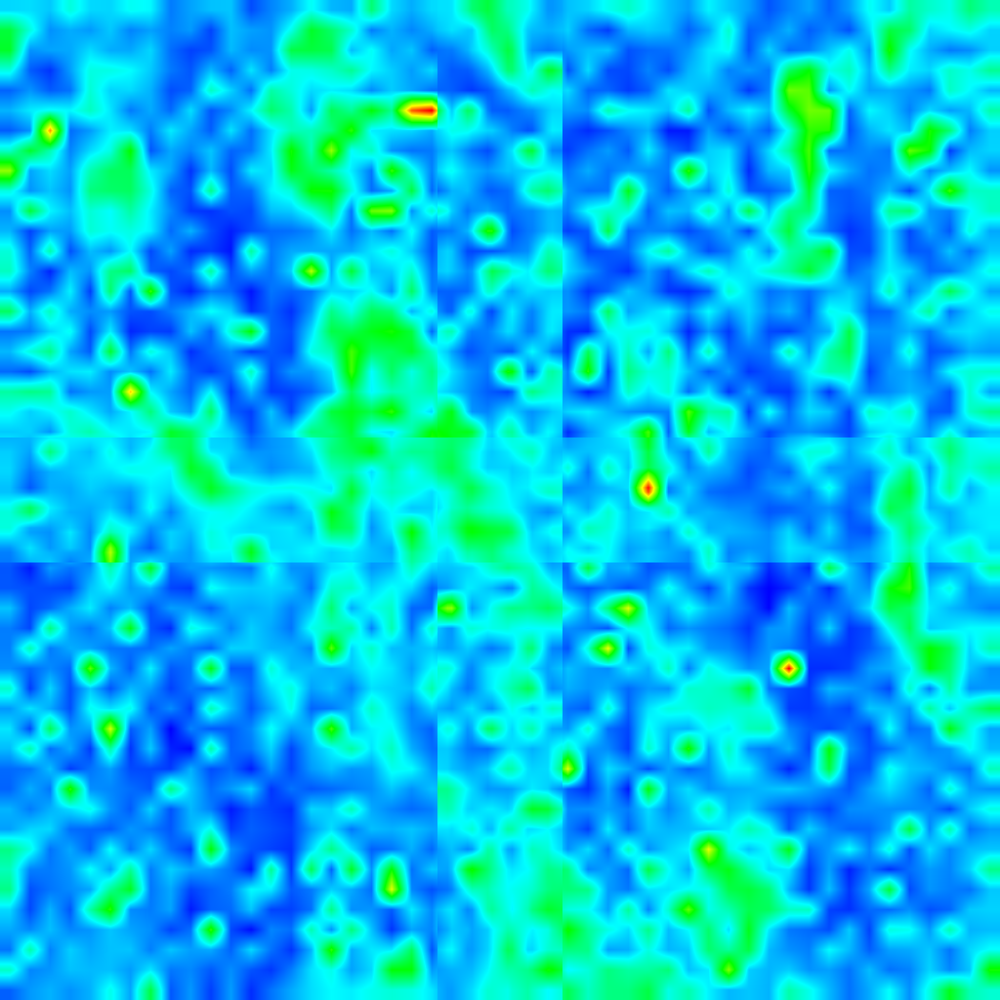

# UniGAD — Universal Generalized Anomaly Detection

DINOv3 백본의 특징만을 활용하여 산업 이상 탐지(Anomaly Detection)를 수행하는 프레임워크입니다.

- **Zero-shot 추론**: 학습된 `W_cls` / `W_seg` 방향 벡터와의 코사인 유사도만으로 판정
- **Few-shot 추론**: 정상 이미지 소수 장에서 메모리 뱅크를 구성하여 NN 거리 점수를 융합
- **Multi-GPU 학습/추론**: `nn.DataParallel` 기반 (DataParallel-safe `HooklessBackbone` 사용)
- **Custom 데이터셋 지원**: MVTec 포맷으로 구성하면 바로 사용 가능
- **Golden Template 지원**: 이상적인 이미지 포맷을 Memory bank로 사용 가능

---

## 프로젝트 구조

```
UniGAD/
├── unigad/                  핵심 라이브러리 (패키지)
│   ├── models/              백본, 분류기, 모델 조립, MultiGPU 래퍼
│   ├── datasets/            MVTec / VisA / BTAD / Custom Patch 데이터셋
│   ├── engine/              학습·평가 루프, 메모리 뱅크
│   ├── utils/               체크포인트, DataLoader, Patch 유틸, 지표 출력
│   ├── transforms.py        이미지 전처리 변환
│   └── losses.py            FocalLoss, DiceLoss
├── scripts/
│   ├── train_standard.py    4개 데이터셋 표준 학습
│   ├── eval_crosseval.py    4×4 크로스 평가
│   ├── train_eval_custom_patch.py    Custom Patch-Crop 학습+추론
│   └── eval_custom_patch_crosseval.py 사전 가중치 → Custom Patch 추론
├── tools/
│   ├── make_golden_template.py   Golden Template 생성
│   ├── generate_heatmap.py       히트맵 생성
│   └── transform_masking.py      마스크 이진화
├── run_train.sh             학습 전용 셸 스크립트
├── run_eval.sh              평가 전용 셸 스크립트
└── run_pipeline.sh          학습 → 평가 전체 파이프라인
```

---

## 1. 환경 설정

### Python 버전

```bash
python 3.10
```

### 패키지 설치

```bash
pip install -r requirements.txt
```

> PyTorch는 CUDA 지원 버전을 설치하는 것을 권장합니다.  
> [https://pytorch.org/get-started/locally/](https://pytorch.org/get-started/locally/) 에서 환경에 맞는 명령어를 확인하세요.

---

## 2. DINOv3 백본 설정

### 2-1. 저장소 클론

```bash
# UniGAD 폴더 안에서 실행
git clone https://github.com/facebookresearch/dinov3
```

> 참고: [facebookresearch/dinov3](https://github.com/facebookresearch/dinov3)

### 2-2. 사전 학습 가중치 다운로드

DINOv3 가중치는 Meta AI에 접근 요청 후 수신한 URL로 다운로드합니다.

1. [https://ai.meta.com/resources/models-and-libraries/dinov3-downloads/](https://ai.meta.com/resources/models-and-libraries/dinov3-downloads/) 에서 접근 요청 제출
2. 승인 메일에 포함된 URL로 가중치 다운로드

```bash
# 다운로드 예시 (wget 사용 권장)
mkdir -p dinov3/pretrained
wget -O dinov3/pretrained/dinov3_vitl16_pretrain_lvd1689m-8aa4cbdd.pth \
    "<승인 메일의 URL>"
```

이 프로젝트에서 사용하는 기본 모델은 **DINOv3 ViT-L/16 (LVD-1689M)** 입니다.

| 모델 | 파라미터 | 학습 데이터 | 파일명 |
|------|---------|------------|--------|
| ViT-L/16 | 300M | LVD-1689M (웹 이미지) | `dinov3_vitl16_pretrain_lvd1689m-8aa4cbdd.pth` |

---

## 3. 데이터셋 구성

### 지원 포맷

| 데이터셋 | 포맷 |
|----------|------|
| MVTec AD | MVTec 포맷 |
| VisA | VisA 포맷 (`Data/Images/Normal`, `Data/Images/Anomaly`) |
| BTAD | BTAD 포맷 (`ok`/`ko` 폴더) |
| **Custom** | **MVTec 포맷과 동일하게 구성하면 바로 사용 가능** |

### MVTec 포맷 (Custom 데이터셋 기준)

```
<dataset_root>/
  <category>/
    train/
      good/          *.png   (정상 학습 이미지)
    test/
      good/          *.png   (정상 테스트, label=0)
      <defect_type>/ *.png   (이상 테스트, label=1)
    ground_truth/
      <defect_type>/ *_mask.png   (픽셀 마스크, 없어도 무방)
```

> 마스크 파일이 없는 경우 Image AUROC/AUPR만 계산되고, Pixel 지표는 NaN으로 처리됩니다.

---

## 4. 학습

### 4-1. 표준 학습 (4개 데이터셋)

```bash
# 셸 스크립트로 실행 (경로는 run_train.sh 내부에서 Data 폴더 기준으로 자동 설정)
./run_train.sh

# 특정 데이터셋만 학습
./run_train.sh --train_targets mvtec visa

# 이미 체크포인트가 있어도 강제 재학습
./run_train.sh --force
```

직접 Python으로 실행:

```bash
python scripts/train_standard.py \
    --mvtec_root  /path/to/MVTec \
    --visa_root   /path/to/VisA \
    --custom_root    /path/to/Custom \
    --btad_root   /path/to/BTAD \
    --ckpt_dir    checkpoints \
    --dinov3_repo dinov3 \
    --dinov3_weights dinov3/pretrained/dinov3_vitl16_pretrain_lvd1689m-8aa4cbdd.pth \
    --epochs 50 --batch_size 256 --patience 5 \
    --train_targets mvtec visa jvm btad
```

학습 완료 후 저장되는 체크포인트 (best epoch 가중치):

```
checkpoints/
  ckpt_trained_on_mvtec.pth
  ckpt_trained_on_visa.pth
  ckpt_trained_on_custom.pth
  ckpt_trained_on_btad.pth
```

---

## 5. 평가

### 5-1. 4×4 크로스 평가

학습된 4개 가중치를 각각 로드하여 4개 데이터셋 전체에 평가합니다.

```bash
# 셸 스크립트로 실행
./run_eval.sh

# Zero-shot만
./run_eval.sh --mode zero_shot

# 특정 조합만
./run_eval.sh --ckpts mvtec --eval_datasets custom --mode both
```

직접 Python으로 실행:

```bash
python scripts/eval_crosseval.py \
    --ckpt_dir    checkpoints \
    --mvtec_root  /path/to/MVTec \
    --visa_root   /path/to/VisA \
    --custom_root    /path/to/Custom \
    --btad_root   /path/to/BTAD \
    --mode both \
    --few_shot_ks 1 2 4 \
    --ckpts       mvtec visa custom btad \
    --eval_datasets mvtec visa custom btad \
    --result_path results_crosseval.json
```

### 5-2. 전체 파이프라인 (학습 → 평가 순서)

```bash
./run_pipeline.sh
```

### 평가 지표

| 지표 | 설명 |
|------|------|
| Image AUROC | 이미지 단위 이상 탐지 AUROC |
| Image AUPR | 이미지 단위 이상 탐지 AUPR |
| Pixel AUROC | 픽셀 단위 이상 영역 탐지 AUROC |
| Pixel AUPR | 픽셀 단위 이상 영역 탐지 AUPR |

결과는 콘솔 요약표와 JSON 파일로 저장됩니다.

---

## 6. Golden Template을 활용한 Few-shot 추론

이미지 수가 매우 적거나 특정 외관의 "이상적인 정상 이미지"가 필요한 경우,  
실제 양품 이미지 여러 장을 평균하여 **Golden Template**을 생성하고  
Few-shot 메모리 뱅크 입력으로 사용합니다.

### Golden Template 생성

```bash
python tools/make_golden_template.py \
    --custom_root    /path/to/Custom \
    --output_root /path/to/CustomGolden \
    --n_select    10 \
    --n_trials    4
```

- `--n_select`: 시행당 랜덤 선택 이미지 수 (기본: 10장)
- `--n_trials`: 반복 시행 수 → 총 `n_trials`장의 평균 이미지 생성 (기본: 4장)
- 각 시행에서 이전에 뽑힌 이미지도 다음 시행에서 다시 선택될 수 있습니다

생성 결과 구조 (MVTec train/good 포맷):

```
CustomGolden/
  <category>/
    train/
      good/
        golden_01.png
        golden_02.png
        golden_03.png
        golden_04.png
```

### Golden Template으로 평가 실행

크로스 평가 시:

```bash
python scripts/eval_crosseval.py \
    --custom_root    /path/to/CustomGolden \   # support 소스를 Golden으로 교체
    --mode few_shot \
    --few_shot_ks 4
```

---

## 7. Custom Patch-Crop 학습 및 추론

원본 고해상도 이미지(예: 1024×1024)에서 결함이 작아  
전체 이미지를 리사이즈하면 결함이 소실되는 경우에 적용합니다.

### Patch-Crop 전략

```
원본 1024×1024
        ↓  576×576 크롭, 128px 중첩
  P0 [0:576,    0:576  ]   P1 [0:576,    448:1024]
  P2 [448:1024, 0:576  ]   P3 [448:1024, 448:1024]
        ↓  각 패치 448×448로 리사이즈
        ↓  DINOv3 입력
```

- 4개 패치 각각에 대해 독립적으로 추론
- **위치별 메모리 뱅크**: P0 패치는 P0끼리, P1은 P1끼리만 비교하여 위치 의존성 해소
- **이미지 점수**: 4 패치 중 최댓값 사용
- **픽셀 히트맵**: 4 패치 히트맵을 원본 해상도로 stitch (겹침 영역은 평균)

### 학습 및 추론 실행

```bash
python scripts/train_eval_custom_patch.py \
    --custom_root /path/to/Custom \
    --golden_root /path/to/CustomGolden \
    --ckpt_path   checkpoints/ckpt_custom_patch.pth \
    --epochs 50 --batch_size 256 --patience 5
```

학습을 건너뛰고 추론만:

```bash
python scripts/train_eval_custom_patch.py \
    --custom_root /path/to/Custom \
    --golden_root /path/to/CustomGolden \
    --skip_train
```

### 사전 학습된 가중치(MVTec/VisA/BTAD)로 Custom Patch 추론

별도 학습 없이 기존 모델로 Custom 데이터를 patch-crop 방식으로 추론할 수 있습니다.

```bash
python scripts/eval_custom_patch_crosseval.py \
    --custom_root    /path/to/Custom \
    --golden_root /path/to/CustomGolden \
    --ckpt_dir    checkpoints \
    --models      mvtec visa btad
```

추론 모드 3가지가 동시에 측정됩니다:

| 모드 | 설명 |
|------|------|
| `zero_shot` | 메모리 뱅크 없이 W_cls / W_seg 점수만 사용 |
| `few_shot_standard` | Custom train/good 이미지 → 위치별 메모리 뱅크 |
| `few_shot_golden` | Golden Template 이미지 → 위치별 메모리 뱅크 |

---

## 8. 히트맵 생성

```bash
python tools/generate_heatmap.py \
    --dataset_root /path/to/Custom \
    --ckpt_path    checkpoints/ckpt_trained_on_mvtec.pth \
    --output_dir   outputs/heatmaps \
    --dinov3_repo  dinov3 \
    --dinov3_weights dinov3/pretrained/dinov3_vitl16_pretrain_lvd1689m-8aa4cbdd.pth
```
(추가) patch 단위로 추론한 이미지 히트맵
```bash
python scripts/generate_patch_heatmap.py \
    --custom_root /path/to/Custom \
    --golden_root /path/to/CustomGolden \
    --ckpt_path   checkpoints/ckpt_custom_patch.pth \
    --mode        both
```
 

---

## 참고 자료

- UniADet: [UniADet Github](https://github.com/gaobb/UniADet)
- DINOv3 공식 저장소: [https://github.com/facebookresearch/dinov3](https://github.com/facebookresearch/dinov3)
- DINOv3 가중치 다운로드: [https://ai.meta.com/resources/models-and-libraries/dinov3-downloads/](https://ai.meta.com/resources/models-and-libraries/dinov3-downloads/)
